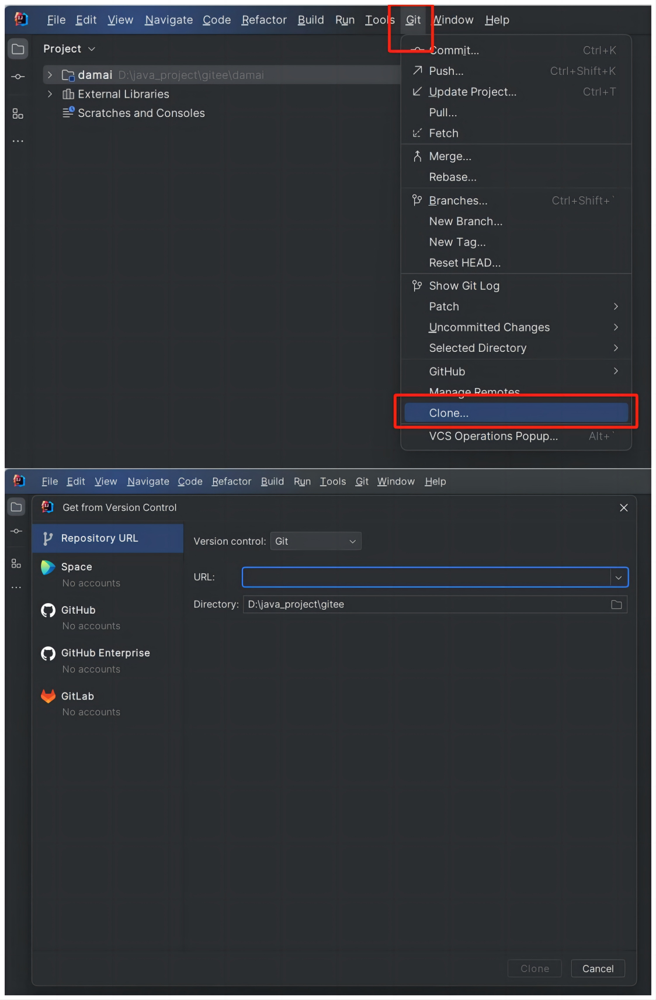
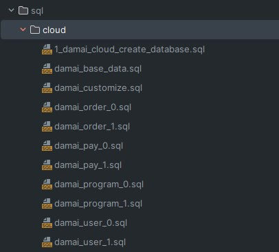
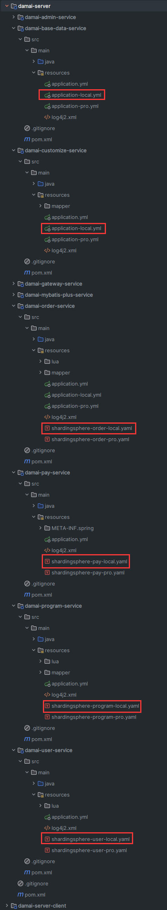

# 准备项目启动条件

# 项目下载
#### 项目地址：
[https://gitee.com/java-up-up/damai](https://gitee.com/java-up-up/damai)

#### 项目HTTPS克隆地址：
```plain
git clone https://gitee.com/java-up-up/damai.git
```

#### 项目SSH克隆地址：
```plain
git clone git@gitee.com:java-up-up/damai.git
```


#### <font style="color:#DF2A3F;">克隆项目注意：</font>
要使用git clone使用上述的HTTPS或者SSH地址克隆下载项目，不要下载ZIP，否则不会通过git关联到项目的远程仓库，不能够git pull更新项目

# damai_pro项目注意点：
<font style="color:rgb(47, 48, 52);">damai_pro是开源版本damai的升级版，在此基础上又额外解决kafka宕机、Redis宕机、异步生成订单的数据丢失、数据不一致等一系列的问题，damai_pro项目不再开源，而是采用闭源的方式，托管在了私有库上。</font>

<font style="color:rgb(47, 48, 52);"></font>

<font style="color:rgb(47, 48, 52);">加入星球的小伙伴可以按照以下方式进行申请damai_pro项目，开通后，直接用git下载damai_pro版本的项目学习就可以了，普通版本的功能和pro版本的功能在damai_pro项目都有，所以普通版本的damai项目就不用再去下载了</font>

**<font style="color:rgb(47, 48, 52);"></font>**

**<font style="color:rgb(47, 48, 52);">申请和学习damai_pro项目：</font>**[<font style="color:rgb(86, 120, 149);">https://articles.zsxq.com/id_m4d7ni4zwkbq.html</font>](https://articles.zsxq.com/id_m4d7ni4zwkbq.html)

# IntelliJ  IDEA导入项目
知道了项目地址后，使用IntelliJ  IDEA将项目导入



通过 IntelliJ  IDEA将项目导入，URL为项目的https或者ssh地址，Directory为项目的目录，当项目克隆下来后，等待IntelliJ  IDEA通过maven将项目构建完毕

#### <font style="color:#DF2A3F;">项目目录注意：</font>
项目所在的目录中**不要有中文！**必须是全英文的，否则在服务启动时会出现class找不到的问题！


为了加快maven的构建速度，小伙伴可在自己电脑的maven中配置阿里云的镜像仓库

##### 文件位置
```plain
apache-maven-3.6.3\conf\settings.xml
```

##### 阿里云仓库配置
```xml
<mirrors>
	 <mirror>
      <id>aliyunmaven</id>
      <mirrorOf>*</mirrorOf>
      <name>阿里云公共仓库</name>
      <url>https://maven.aliyun.com/repository/public</url>
    </mirror>
	
  </mirrors>
```

当项目构建完毕后，可在项目根目录下执行

```plain
mvn clean compile
```

编译一下项目是否有错误

# 安装需要的中间件
项目中依赖了Mysql、Nacos、Redis、kafka、Elasticsearch的相关中间件，可参考下列文档直接使用本人提供的中间件云环境地址或者本地搭建

[如何安装项目需要的中间件环境](https://www.yuque.com/u22210564/ykdrdh/pm68yrkbf3bgewun)

# 导入数据库表和数据
### 分库分表说明
每个服务下使用自己的库，除了base-data、customize服务外，其余的服务使用了分库分表的结构，

### 导入相关数据
sql文件分为**创建数据库、创建表和数据**

### sql文件位置


### 如何执行sql文件
1. 先执行cloud文件夹中 **1_damai_cloud_create_database.sql** 创建好数据库
2. 再执行cloud文件夹中其余的sql文件，这些sql文件没有先后顺序

#### 注意：
如果直接执行sql文件报错的话，可以把sql文件中的语句粘贴到图形化工具的控制台中执行


# 数据库账户和密码配置
#### <font style="color:#DF2A3F;">数据库账户和密码注意：</font>
项目中的数据库账户和密码都为root，所以大家在搭建自己的Mysql数据库时，注意一下密码的设置

如果想修改项目中连接数据库的账户和密码，需要在以下配置文件中进行修改



# 项目的版本
为了适应不同的Springboot版本，本人分别开发了 **Springboot2 **和 **Springboot3 **版本的代码


为了适应目前的市场需要，建议小伙伴直接学习 **<font style="color:#213BC0;">Springboot3版本(jdk17及以上)</font>**

Springboot2版本相对来说确实比较老旧了，之所以保留Springboot2版本是因为要讲解 **Hystrix组件和Ribbon灰度组件，**Springboot3中移除了Hystrix和Ribbon。对这两个功能有需要的小伙伴可学习Springboot2版本

### 如何学习Springboot3版本：
切换到 **main(默认)** 分支即可，最新的内容都会在此版本上更新

### 如何学习Springboot2版本：
切换到 **main-springboot-2** 分支即可，建议小伙伴只在此版本学习 **Hystrix组件和Ribbon灰度组件 **的内容，最新的内容只会在Springboot3版本更新


> 更新: 2025-05-06 22:39:14  
> 原文: <https://www.yuque.com/u22210564/ykdrdh/sggdexgo9rny1b3q>