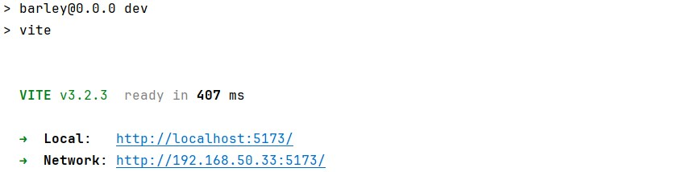
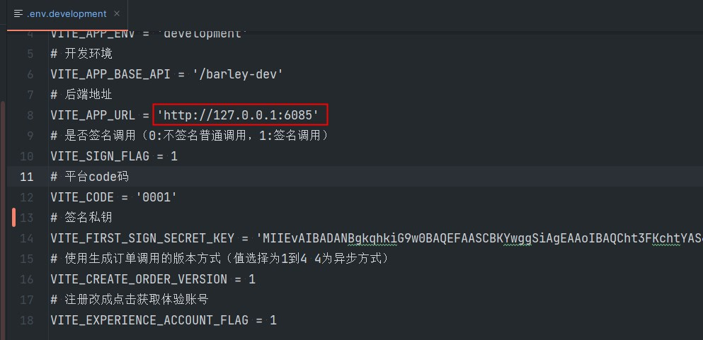
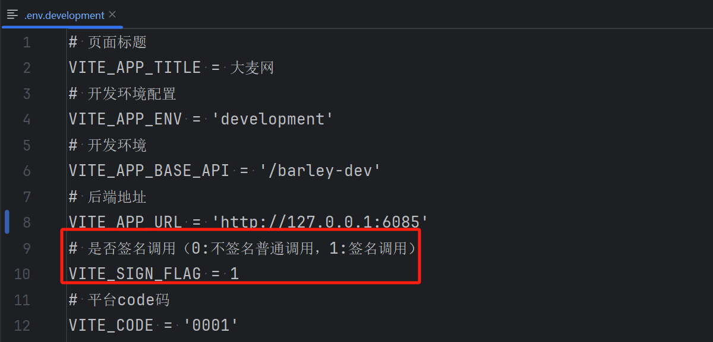
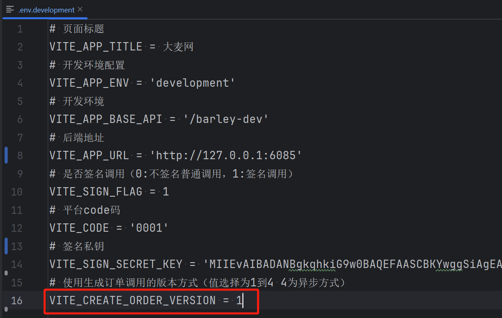

# 前端项目部署启动

大麦的前端项目使用的是vue3来开发的，nodejs版本建议>= 16


## 安装nodejs（如果已经安装并且版本符合可以跳过）
非常详细的安装流程：

[2023最新版Node.js下载安装及环境配置教程（非常详细）从零基础入门到精通，看完这一篇就够了_nodejs安装及环境配置-CSDN博客](https://blog.csdn.net/Python_0011/article/details/132109189)

安装完成后输入如下命令，出现版本信息说明安装成功


## 启动前端项目
进入到 damai/vue3 的目录后，开始执行命令

#### 安装项目需要的依赖
```shell
npm install
```

#### 启动项目
```shell
npm run dev
```

#### 出现启动成功页面


## 项目调用接口地址
在前端项目的配置**.env.development，**检查**VITE_APP_URL**配置项是否为http://127.0.0.1:6085，调用本地服务



## 项目切换接口调用方式
为了让小伙伴方便的切换 不签名普通调用/签名调用 的两种方式，本人在前端项目加了配置项，直接修改配置项就可以切换，不需要修改后端的代码

搜索项目的文件 **.env.development** ，然后修改 **VITE_SIGN_FLAG** 配置。0:不签名普通调用，1:签名调用



## 指定调用生成订单接口版本
由于为了更好的讲解高并发下是如何将生成订单流程进行逐步优化的，所以生成订单接口开发出了4个版本，是逐步提高并发性能，所以前端项目指定了调用生成订单接口版本的配置


在 **.env.development** 文件中的 **<font style="color:#080808;background-color:#ffffff;">VITE_CREATE_ORDER_VERSION</font>**<font style="color:#080808;background-color:#ffffff;"> 配置，值为1到4。对应的就是相应的调用接口的版本</font>


> 更新: 2024-08-02 15:27:28  
> 原文: <https://www.yuque.com/u22210564/ykdrdh/qgm3ewacqf8ak6dh>