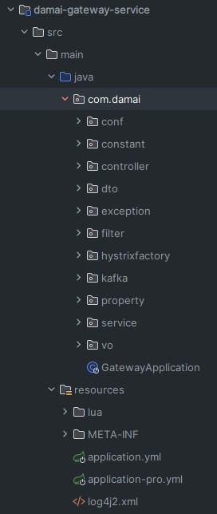
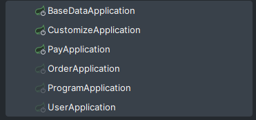
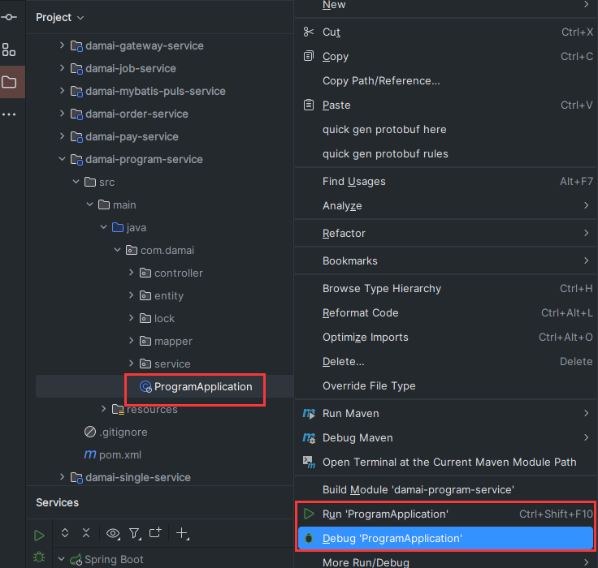
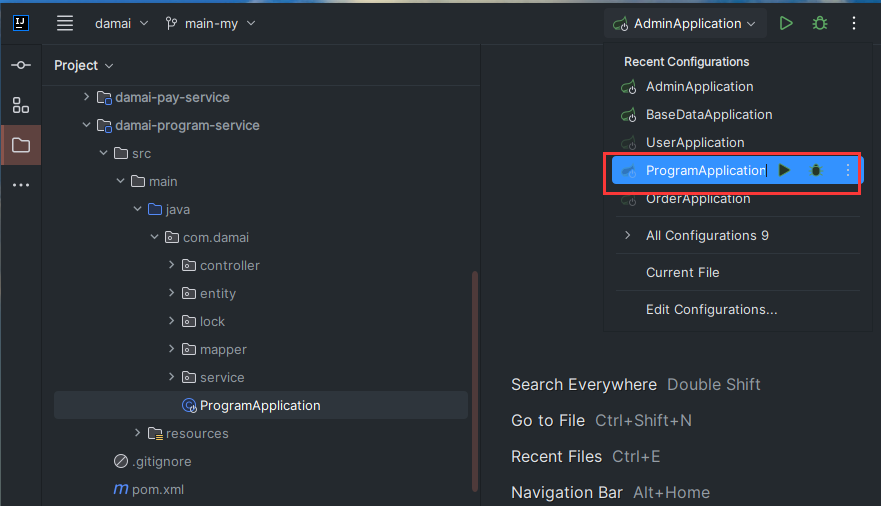
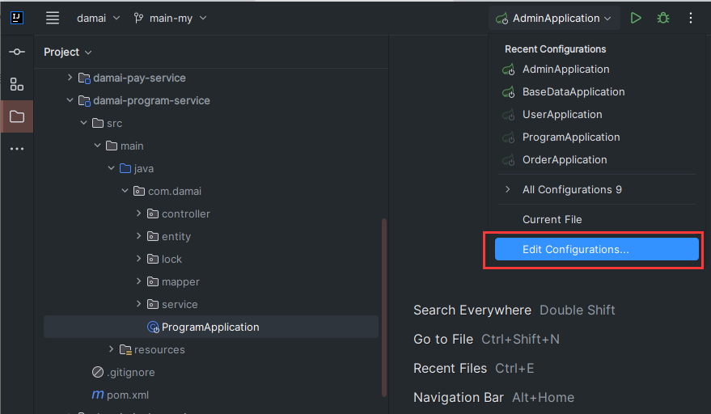
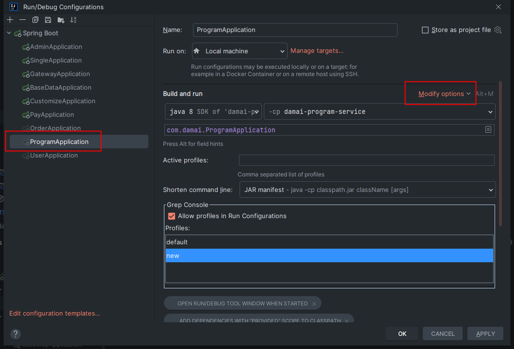
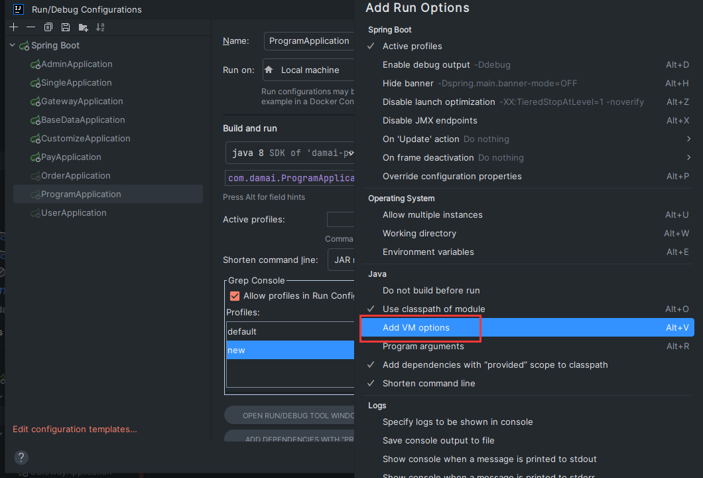
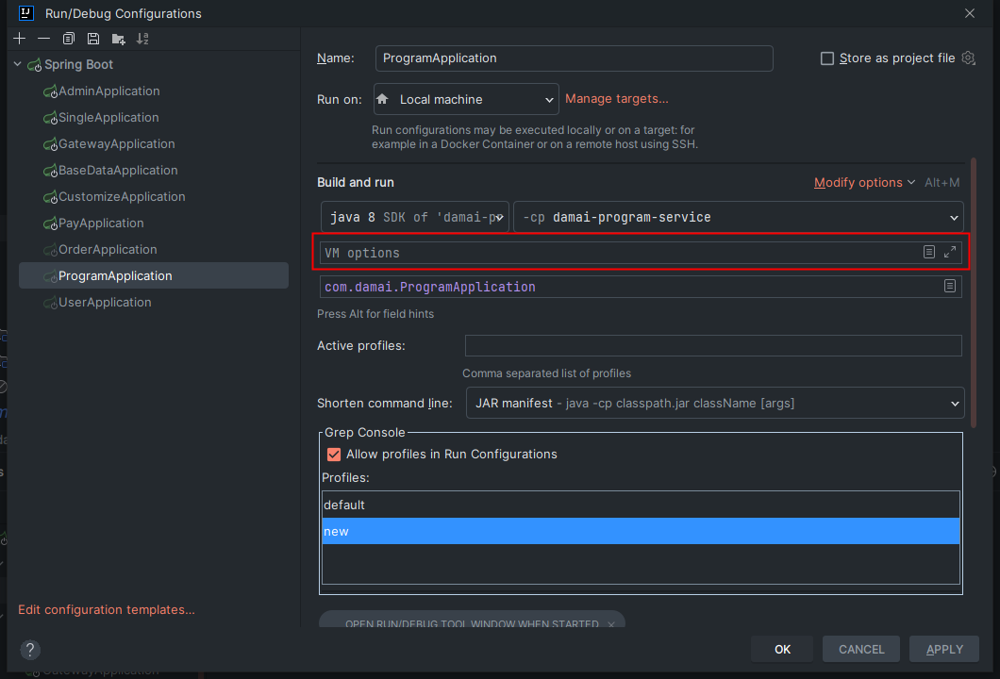
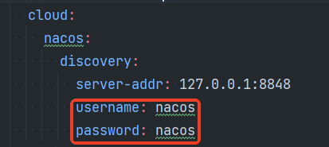
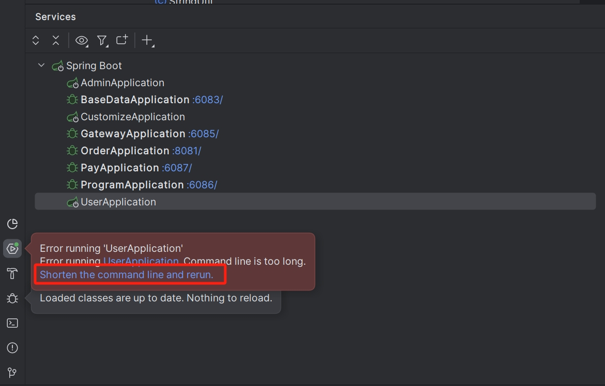

# 后端项目部署启动

小伙伴需要先把这两节内容阅读完毕

[准备项目启动条件](https://www.yuque.com/u22210564/ykdrdh/sggdexgo9rny1b3q)

[如何安装项目需要的中间件环境](https://www.yuque.com/u22210564/ykdrdh/pm68yrkbf3bgewun)

按照文档的说明进行项目和数据库以及中间件的环境都部署完后，就可以开始进行项目的启动了


# Gateway网关项目启动



# 业务服务启动
启动时需要将每个服务都启动起来，**BaseDataApplication**为基础服务所以要第一个启动，其余服务启动时没有先后关系

**CustomizeApplication**为执行限流功能服务、**AdminApplication**为监听服务，**MybatisPlusGenerator**为代码生成器，这三个服务和业务服务分离，可以不启动




# 设置启动参数
项目中设计到中间件的地址都是用的127.0.0.1，如果小伙伴在自己的云服务上搭建了中间件或者使用本人提供的云环境，需要借助设置启动参数的形式将127.0.0.1替换成真正的地址

## 添加步骤(以节目服务为例)
选择对应的SpringBoot启动入口，先进行Run或者Debug启动一下




启动完后，idea的右上角就会有启动管理入口了




然后选择底部的Edit Configurations... 选项




然后选择对应的服务启动入口，选择Modify options菜单




然后选择Add VM options菜单




然后将具体的参数添加进去




Gateway网关服务、和其他的服务都需要设置此参数，并且参数都是相同的

## 详细参数
#### Springboot3（main分支为此版本）
```shell
-XX:MaxMetaspaceSize=256M
-Xmx256M
-Dspring.data.redis.host=${redis地址}
-Dspring.data.redis.password=${redis地址密码}
-Dspring.cloud.nacos.discovery.server-addr=${nacos地址}:8848
-Dspring.kafka.bootstrap-servers=${kafka地址}:9092
-Delasticsearch.ip=${elasticsearch地址}:9200
-Delasticsearch.userName=${elasticsearch账户}
-Delasticsearch.passWord=${elasticsearch账户密码}
-Dprefix.distinction.name=my
```


#### Springboot2（main-springboot-2分支为此版本）
```shell
-XX:MaxMetaspaceSize=256M
-Xmx256M
-Dspring.redis.host=${redis地址}
-Dspring.redis.password=${redis地址密码}
-Dspring.cloud.nacos.discovery.server-addr=${nacos地址}:8848
-Dspring.kafka.bootstrap-servers=${kafka地址}:9092
-Delasticsearch.ip=${elasticsearch地址}:9200
-Delasticsearch.userName=${elasticsearch账户}
-Delasticsearch.passWord=${elasticsearch账户密码}
-Dprefix.distinction.name=my
```


### <font style="color:#DF2A3F;">注意！</font>


项目中配置的连接nacos的账号和密码都是**nacos**

nacos中间件搭建好后默认的账号和密码也都是**nacos**

如果你自己搭建的nacos账号和密码进行了修改，那么项目连接nacos的账号和密码也要修改才行！！！

可以再添加以下密令：

```shell
-Dspring.cloud.nacos.discovery.username=${你的nacos账号}
-Dspring.cloud.nacos.discovery.password=${你的nacos密码}
```


## 替换成本人提供的中间件地址启动命令
如果大家想使用本人提供的中间件来启动的话，可以直接粘贴下面的命令，就不用一个个的替换了，节省小伙伴的时间

#### Springboot3（main分支为此版本）
```shell
-XX:MaxMetaspaceSize=256M
-Xmx512M
-Dspring.data.redis.host=common-framework.com.cn
-Dspring.data.redis.password=vcxz%&356
-Dspring.cloud.nacos.discovery.server-addr=common-framework.com.cn:8848
-Dspring.kafka.bootstrap-servers=common-framework.com.cn:9092
-Delasticsearch.ip=common-framework.com.cn:9200
-Delasticsearch.userName=elastic
-Delasticsearch.passWord=zxc321
-Dprefix.distinction.name=my
```


#### Springboot2（main-springboot-2分支为此版本）
```shell
-XX:MaxMetaspaceSize=256M
-Xmx512M
-Dspring.data.redis.host=common-framework.com.cn
-Dspring.data.redis.password=vcxz%&356
-Dspring.cloud.nacos.discovery.server-addr=common-framework.com.cn:8848
-Dspring.kafka.bootstrap-servers=common-framework.com.cn:9092
-Delasticsearch.ip=common-framework.com.cn:9200
-Delasticsearch.userName=elastic
-Delasticsearch.passWord=zxc321
-Dprefix.distinction.name=my
```

## <font style="color:#DF2A3F;">参数说明（非常重要！！！）</font>
+ `**prefix.distinction.name**`不要用默认的 **<font style="color:#DF2A3F;">my </font>**！！！
    - 它作用是为了多人使用云环境的中间件时，保持每个人的数据唯一，通过此配置在相应的中间件数据中加上前缀就可以实现唯一了，比如Redis中的键名、Nacos的注册服务名、Kafka的Topic、Elasticsearch中的索引名。
    - **<font style="color:#DF2A3F;">所以一定要换成你自己唯一的标识！！！</font>**
    - **<font style="color:#DF2A3F;">注意：</font>****值一定要都小写！（例如mytest）否则es会创建索引失败！**
+ 节目服务的初始化时产生的数据较多，所以内存设置要大一点，可调整 -XX:MaxMetaspaceSize=512M、-Xmx1024M

## 启动错误
有的小伙伴在启动时，会出现如下图中的错误，只要按图中指示，选择 **Shorten the command line and rerun** 即可




> 更新: 2025-07-08 17:18:18  
> 原文: <https://www.yuque.com/u22210564/ykdrdh/abuf6oviie9r26oa>