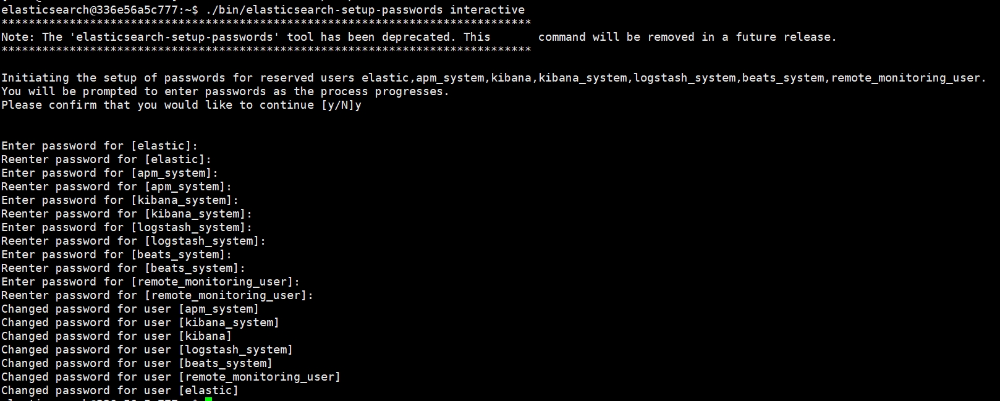
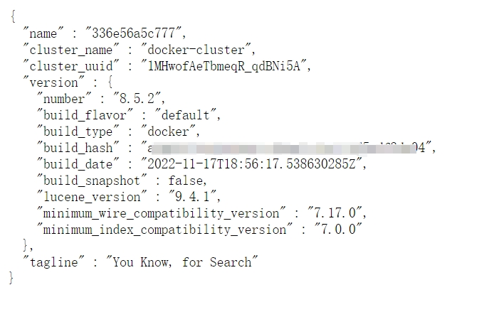
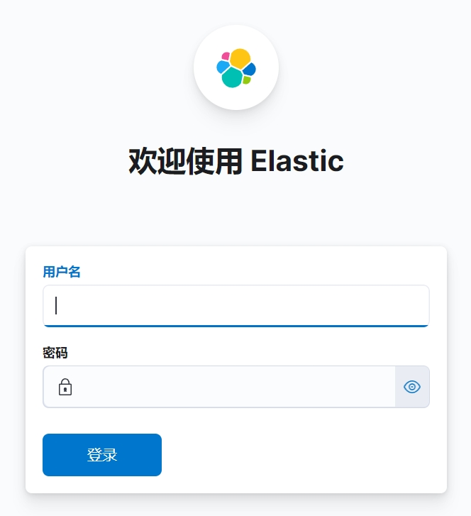

# 如何安装项目需要的中间件环境

# 概要
项目中设计到的中间件有Mysql、Redis、Kafka、Elasticsearch，本文介绍如何在本地进行安装这些中间件，以及如何使用本人提供的中间件环境

为了考虑到小伙伴的时间和学习项目的简便，本人提供了除了Mysql以外(数据库实在是没法提供，多人使用数据就乱套了)，其余中间件的云环境地址，可直接连接相应的地址即可，但由于给多人使用所以稳定性要差点，如果条件允许的话，还是建议大家本地搭建一套


# 中间件云环境地址
### Nacos
+ 地址：common-framework.com.cn:8848
+ 账号：nacos
+ 密码：nacos

### Redis
+ 地址：common-framework.com.cn:6379
+ 密码：<font style="color:rgb(0, 0, 0);">vcxz%&356</font>

### Kafka
+ 地址：common-framework.com.cn:9092

### Elasticsearch
+ 地址：common-framework.com.cn:9200
+ 账号：<font style="color:rgb(0, 0, 0);">elastic</font>
+ 密码：<font style="color:rgb(0, 0, 0);">zxc321</font>

### Kibana
+ 地址：common-framework.com.cn:5601
+ 账号：<font style="color:rgb(0, 0, 0);">elastic</font>
+ 密码：<font style="color:rgb(0, 0, 0);">zxc321</font>

### <font style="color:#DF2A3F;">注意：</font>
如果不能访问了，说明服务器被人攻击了，需要告诉我下，我会尽快进行重启


## 使用本人的中间件地址在项目中的配置步骤：
[后端项目部署启动](https://www.yuque.com/u22210564/ykdrdh/abuf6oviie9r26oa)

# 中间件本地环境安装
## 安装Mysql
#### 配置文件 my.cnf
```plain
[client]
default_character_set=utf8
[mysqld]
collation_server = utf8_general_ci
character_set_server = utf8
```

#### 下载镜像
```shell
docker pull mysql:5.7
```

#### 启动容器
```shell
docker run -d \
-p 3306:3306 \
--privileged=true \
-v /mysql/log:/var/log/mysql \
-v /mysql/data:/var/lib/mysql \
-v /mysql/conf:/etc/mysql/conf.d \
-e MYSQL_ROOT_PASSWORD=root \
--name mysql mysql:5.7
```

+ **-p 3306:3306** 映射宿主机和容器的端口号
+ **--privileged=true** 赋予容器几乎与主机相同的权限
+ **-v /mysql/log:/var/log/mysql** 将Mysql的日志卷持久化到宿主机
+ **-v /mysql/data:/var/lib/mysql** 将Mysql的数据卷持久化到宿主机
+ **-v /mysql/conf:/etc/mysql/conf.d** 指定Mysql的配置从宿主机中读取，将第一步的my.cnf 放入宿主机/mysql/conf目录
+ **-e MYSQL_ROOT_PASSWORD=root**设置数据库密码
+ **--name mysql** 容器名为mysql

## 安装Nacos
### docker安装
#### 下载镜像
```shell
docker pull nacos/nacos-server:v2.2.3
```

#### 启动容器(没有开启鉴权方式)
```shell
docker run -d --name nacos-server -p 8848:8848 -p 9848:9848 -e MODE=standalone nacos/nacos-server:v2.2.3
```

#### 注意
启动时采用默认配置没有开启鉴权功能，如需开启，需要在docker中的配置文件开启鉴权操作，docker配置文件位置：/home/nacos/conf/application.properties

官网鉴权开启说明：[Authorization](https://nacos.io/zh-cn/docs/v2/guide/user/auth.html)

#### 启动容器(开启鉴权方式)
```shell
docker run -d \
-p 8848:8848 \
-p 9848:9848 \
-e MODE=standalone \
-e nacos.core.auth.enabled=true \
-e nacos.core.auth.plugin.nacos.token.secret.key=SecretKey012345678901234567890123456789012345678901234567890123456789 \
-e nacos.core.auth.server.identity.key=XN3zr6HfJV%LjUPjRBQzBB \
-e nacos.core.auth.server.identity.value=B3CU%K3AxEAMrgPBdKLRQRL \
--name nacos-server nacos/nacos-server:v2.2.3
```

+ nacos.core.auth.plugin.nacos.token.secret.key
+ nacos.core.auth.server.identity.key
+ nacos.core.auth.server.identity.value

这三个配置是开启鉴权必须添加的配置，值可以直接使用上面命令示例中的。如果想提高安全，推荐设置为Base64编码的字符串，且原始密钥长度不得低于32字符

### 本地安装
本人还提供了现成的压缩包，只要解压执行脚本即可启动，部署到自己服务器上或者本地启动更加方便(需要先配置jdk环境)

#### 下载地址
```plain
链接：https://pan.baidu.com/s/1OQssDNRXOJ0vrstfLlYt4g?pwd=6xt5 
提取码：6xt5
```

#### linux包解压命令
```shell
tar -zxvf nacos-server-2.2.4.tar.gz
cd nacos/bin
```

#### 启动命令
Linux/Unix/Mac

```shell
sh startup.sh
```

Windows

```shell
startup.cmd
```

## 安装Redis
#### 下载镜像
```shell
docker pull redis:6.0.8
```

#### 启动容器
```shell
docker run -d --name redis -p 6379:6379 -e "requirepass=123" redis:6.0.8
```

+ **-e "requirepass=123"** 为密码

## 安装Zookeeper
#### 下载镜像
```shell
docker search zookeeper
docker pull zookeeper
```

#### 配置文件
新建文件夹

```shell
mkdir -p /usr/local/zookeeper/conf
```

将zookeeper的配置文件放入此文件夹内

##### <font style="color:rgb(0, 0, 0);">配置文件 文件名zoo.cfg</font>
```plain
# The number of  milliseconds of each tick
tickTime=2000
# The number of ticks that the initial
# synchronization phase can take
initLimit=10
# The number of ticks that can pass between
# sending a request and getting an acknowledgement
syncLimit=5
# the directory where the snapshot is stored.
# do not use /tmp for storage, /tmp here is just
# example sakes.
dataDir=/data
# the port at which the clients will connect
clientPort=2181
# the maximum number of client connections.
# increase this if you need to handle more clients
#maxClientCnxns=60
#
# Be sure to read the maintenance section of the
# administrator guide before turning on autopurge.
#
# http://zookeeper.apache.org/doc/current/zookeeperAdmin.html#sc_maintenance
#
# The number of snapshots to retain in dataDir
#autopurge.snapRetainCount=3
# Purge task interval in hours
# Set to "0" to disable auto purge feature
#autopurge.purgeInterval=1

## Metrics Providers
#
# https://prometheus.io Metrics Exporter
#metricsProvider.className=org.apache.zookeeper.metrics.prometheus.PrometheusMetricsProvider
#metricsProvider.httpPort=7000
#metricsProvider.exportJvmInfo=true
```

#### 启动容器
```shell
docker run -d \
--name zookeeper \
--privileged=true \
-p 2181:2181 \
--restart=always \
-v /usr/local/zookeeper/data:/data \
-v /usr/local/zookeeper/conf:/conf \
-v /usr/local/zookeeper/logs:/datalog \
zookeeper
```

## 安装Kafka
#### 下载镜像
```shell
docker search wurstmeister/kafka
docker pull wurstmeister/kafka
```

#### 启动容器
```shell
docker run -d --name kafka \
-p 9092:9092 \
-e KAFKA_BROKER_ID=0 \
-e KAFKA_ZOOKEEPER_CONNECT=zookeeper地址:2181 \
-e KAFKA_ADVERTISED_LISTENERS=PLAINTEXT://本地ip:9092 \
-e KAFKA_LISTENERS=PLAINTEXT://0.0.0.0:9092 wurstmeister/kafka
```

+ -e KAFKA_ZOOKEEPER_CONNECT 指定zookeeper地址，如果zookeeper和kafka部署在一台云服务器，则地址可配置内网ip
+ -e KAFKA_ADVERTISED_LISTENERS Kafka 的一个环境变量，用于指定 Kafka 将如何通告客户端它在外部可访问的地址。如果是云服务器，则得是公网ip，因为客户端连接的kafka地址要和这个一样


## 安装<font style="color:rgb(0, 0, 0);">ElasticSearch</font>
为了和后续的Kibana相通信，<font style="color:rgb(0, 0, 0);">需要先用 docker 创建一个网络</font>

#### <font style="color:rgb(0, 0, 0);">建立容器间的通信</font>
```shell
docker network create elk
```

#### 下载镜像
```shell
docker pull elasticsearch:8.5.2
```

#### 启动容器
```shell
docker run -d --name es \
--net elk \
-p 9200:9200 \
-p 9300:9300 \
-e "discovery.type=single-node" \
-e ES_JAVA_OPTS="-Xms768m -Xmx768m" \
-e "xpack.security.http.ssl.enabled=false" \
-e "xpack.security.enrollment.enabled=true" \
elasticsearch:8.5.2
```

+ **<font style="color:rgb(0, 0, 0);">-p</font>**<font style="color:rgb(0, 0, 0);"> （小写）映射端口号，主机端口:容器端口</font>
+ **<font style="color:rgb(0, 0, 0);">-P</font>**<font style="color:rgb(0, 0, 0);">（大写）随机为容器指定端口号</font>
+ **<font style="color:rgb(0, 0, 0);">–name</font>**<font style="color:rgb(0, 0, 0);"> 指定容器别名</font>
+ **<font style="color:rgb(0, 0, 0);">–net</font>**<font style="color:rgb(0, 0, 0);"> 连接指定网络</font>
+ **<font style="color:rgb(0, 0, 0);">-e</font>**<font style="color:rgb(0, 0, 0);"> 指定启动容器时的环境变量</font>
+ **<font style="color:rgb(0, 0, 0);">-d</font>**<font style="color:rgb(0, 0, 0);"> 后台运行容器</font>
+ **<font style="color:rgb(0, 0, 0);">xpack.security.http.ssl.enabled=false</font>**<font style="color:rgb(0, 0, 0);"> 关闭https访问</font>
+ **<font style="color:rgb(0, 0, 0);">xpack.security.enrollment.enabled=true</font>**<font style="color:rgb(0, 0, 0);"> 设置为true，可设置密码</font>

#### <font style="color:rgb(0, 0, 0);">设置密码</font>
```shell
# 进入容器
docker exec -it es /bin/bash
# 执行命令配置密码
./bin/elasticsearch-setup-passwords interactive
```



<font style="color:rgb(0, 0, 0);">设置成功后，在浏览器上输入地址 ip:9200，登入密码看到如下页面说明安装成功</font>



## <font style="color:rgb(0, 0, 0);">安装Kibana</font>
这里Kibana的版本最好和<font style="color:rgb(0, 0, 0);">ElasticSearch的版本一致</font>

#### 下载镜像
```shell
docker pull kibana:8.5.2
```

#### 启动容器
```shell
docker run -d --name kibana \
--net elk \
-p 5601:5601 \
-e ELASTICSEARCH_HOSTS=http://ElasticSearch的地址:9200 \
-e ELASTICSEARCH_USERNAME="kibana_system" \
-e ELASTICSEARCH_PASSWORD="密码" \
-e "I18N_LOCALE=zh-CN" \
kibana:8.5.2
```

+ **-p 5601:5601** 映射端口号
+ -**e ELASTICSEARCH_HOSTS=http://ElasticSearch的地址:9200** 指定ElasticSearch地址
+ **-e ELASTICSEARCH_USERNAME="kibana_system"** 指定ElasticSearch账户
+ **-e ELASTICSEARCH_PASSWORD="密码"** 指定ElasticSearch账户密码
+ **I18N_LOCALE=zh-CN** 开启 kibana 的汉化


<font style="color:rgb(0, 0, 0);">启动kibana后，输入地址 ip:5601，出现如下页面说明启动成功</font>




> 更新: 2025-07-09 14:44:50  
> 原文: <https://www.yuque.com/u22210564/ykdrdh/pm68yrkbf3bgewun>