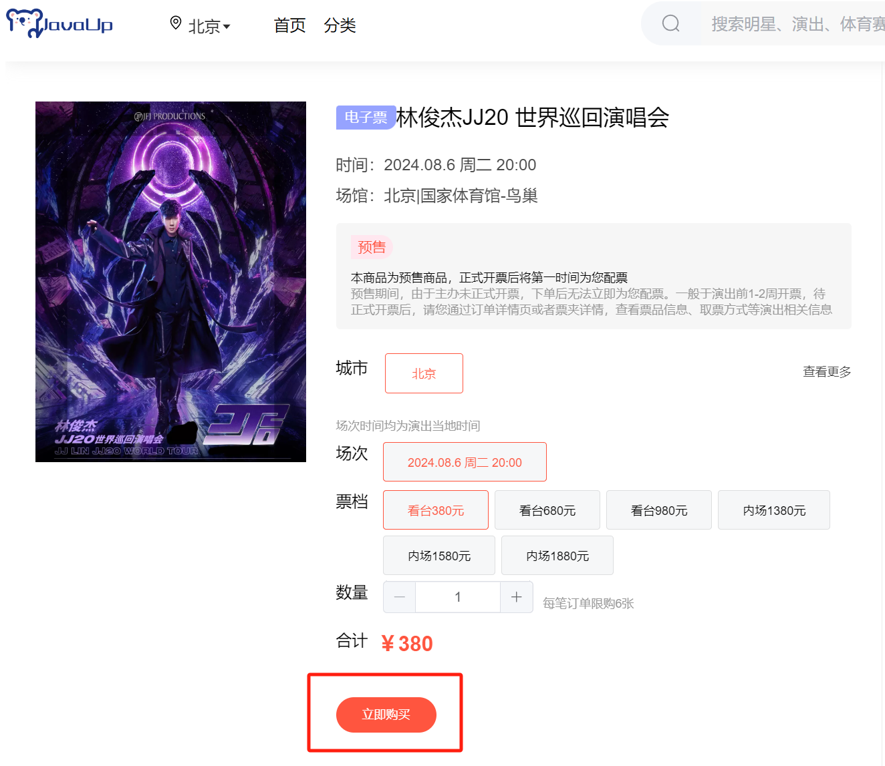
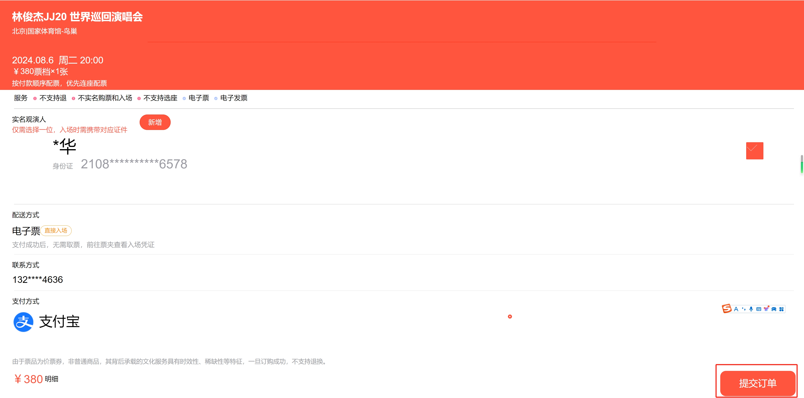
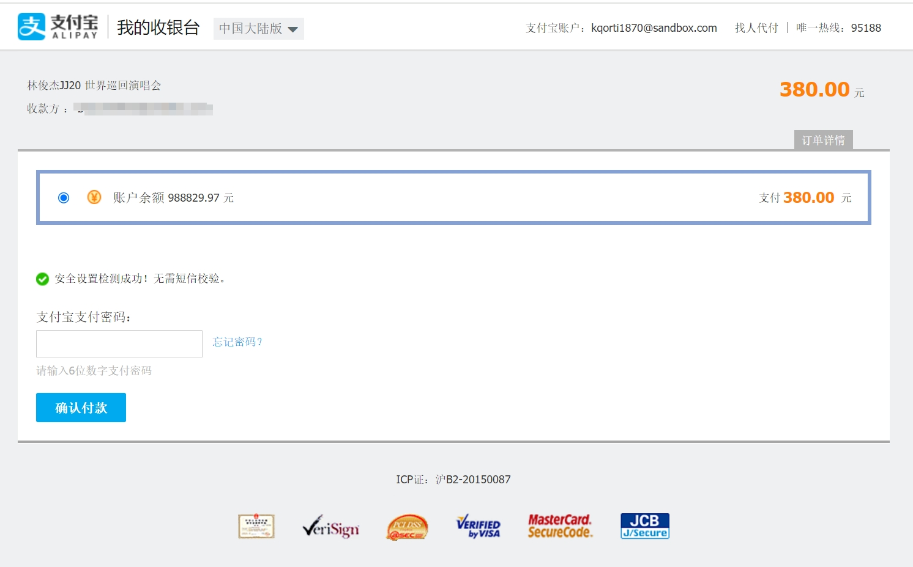
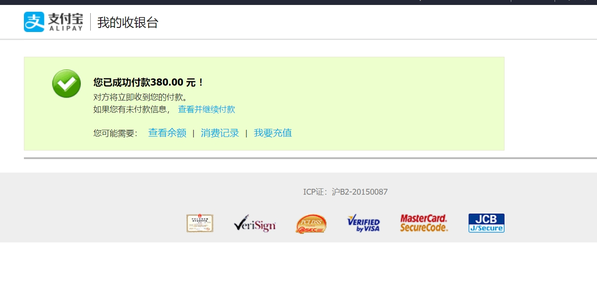
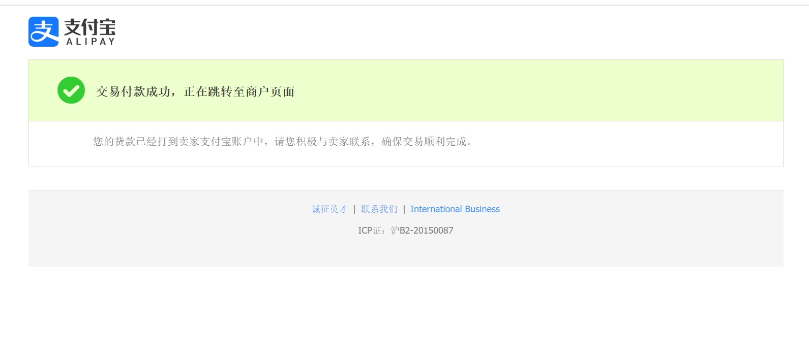
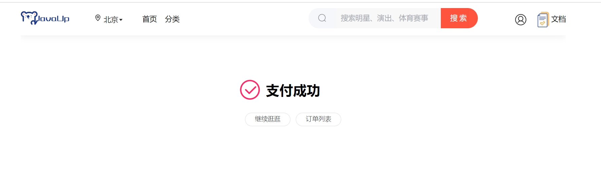
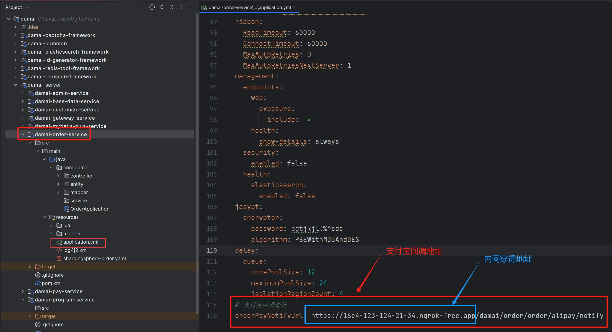
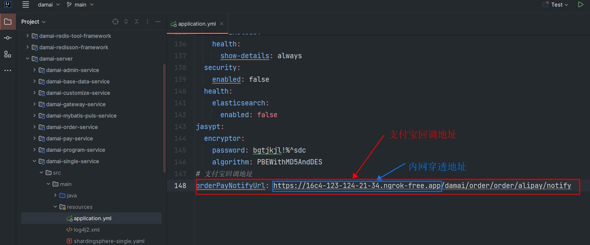

# 基础讲解-如何启用支付功能

在支付流程中，用户使用支付宝/微信支付后，支付宝/微信会回调我们指定的地址，从而更新订单状态，而且这个地址要求必须公网访问，需要借助内网穿透工具，此工具详细介绍和配置，在下面会详细介绍

如果小伙伴觉得每次安装启动内网穿透工具很麻烦的话，也不用担心，可以不安装。项目中也支持主动查询，当用户使用支付宝支付后，支付宝会跳转到我们指定的成功页面，在此页面会主动查询支付结果，从而更新数据

## 主动查询支付结果流程注意点
当输入支付宝账号和支付密码后，支付宝会跳转到支付宝的成功付款页面，然后过几秒会跳转到付款成功，正在跳转商户页面，接着会跳转到我们自己的支付成功页面

**这三个页面会依次自动的跳转！所以不要主动的关闭，否则就不会去主动的查询支付结果！**

## 完整支付流程
#### 1 选择某个节目/演唱会，点击进入详情后，选择相应的场次和票档，然后点击立即购买

#### 2 选择购票人后，点击提交订单

#### 3 选择支付宝付款

#### 4 输入支付宝账号和支付密码
##### 账号
kqorti1870@sandbox.com

##### 登录密码
111111

##### 支付密码
111111

#### 5 再次输入支付宝支付密码

#### 6 成功付款页面（不要关闭！过几秒会自动跳转到下一个 “付款成功，正在跳转至商户页面”的页面）

#### 7 付款成功，正在跳转至商户页面 的页面（不要关闭！过几秒会自动跳转到下一个我们自己的支付成功页面）

#### 8 支付成功页面 （在此页面加载后，会主动查询支付结果，从而更新数据）

## 安装内网穿透工具ngrok
当在支付宝支付页面输入账号后，支付宝会回调我们在支付时传入的回调地址，因为是支付宝访问，所以这个地址一定要是 公网地址 才可以。但是 我们在本地开发时怎么办？

不用担心，可以借助内网穿透工具，让本地的网络环境转变为成公网可以访问的地址，ngrok就是常用的内网穿透工具，具体的安装教程可以参考以下教程：

[如何安装ngrok](https://www.yuque.com/u22210564/ykdrdh/bwmy16g2tz6h5sec)

## 项目中配置地址
当在内网穿透工具配置好地址后，我们就要在项目中配置了，这里将聚合服务和微服务都进行说明

#### 微服务配置 在order-service订单服务中

#### 单体服务配置 在single-service服务中

> 更新: 2025-05-06 22:55:55  
> 原文: <https://www.yuque.com/u22210564/ykdrdh/mdl1hv5rk96tkgr6>