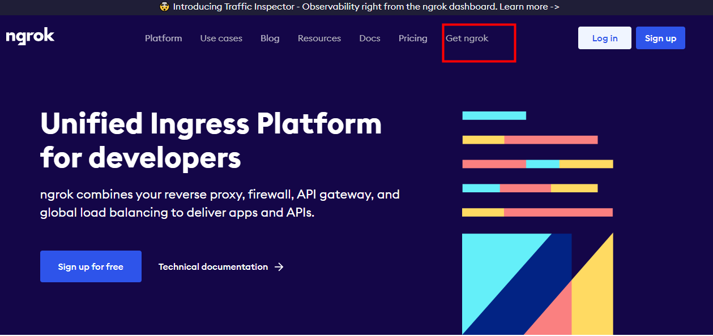
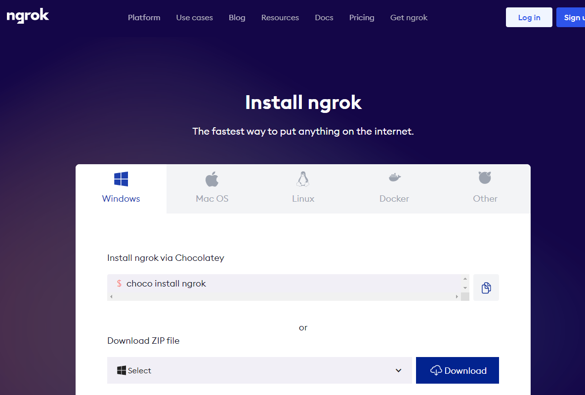
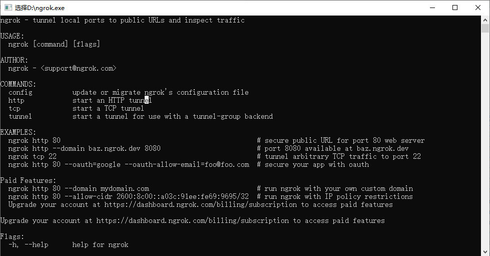
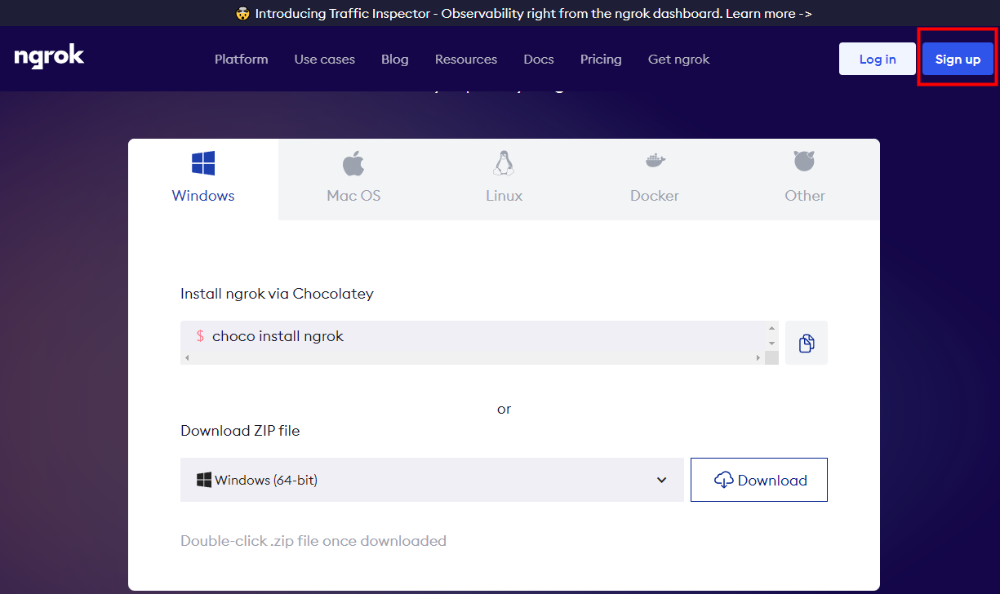
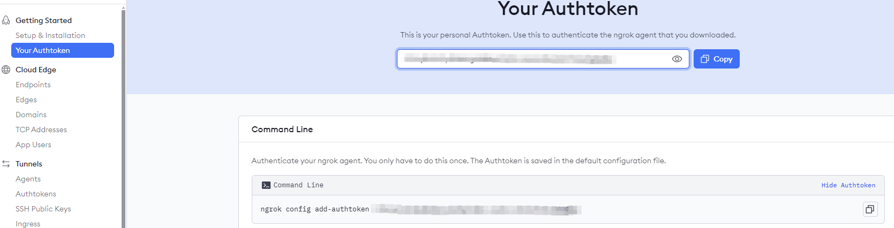
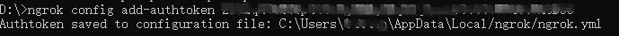
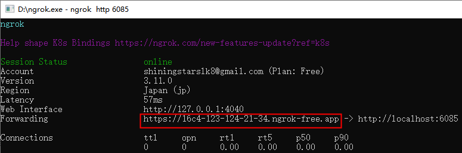

# 基础讲解-如何安装ngrok


**1 输入地址**

[ngrok | Unified Application Delivery Platform for Developers](https://ngrok.com/)


**2 点击 Get ngrok**




**3 选择下载平台，我选择的是windows**




**4 下载后得到压缩文件，然后进行解压，得到ngrok.exe文件**


**5 启动该文件**




**6 接下来需要注册一个ngrok的账号来获取属于你的密钥**



可以使用你的github账号登录


**7 获取到秘钥**




**8 执行命令**

```shell
ngrok config add-authtoken xxxxx
```

xxxx 替换成你自己的秘钥


**9 执行成功后，命令行界面中会出现下面的信息。此时，代表配置成功。ngrok程序已经在你的用户目录下，创建一个.ngrok2文件夹，并在文件夹中创建一个配置文件ngrok.yml**




**10 在命令行界面中，执行下面命令，即将本地端口映射到外网中，我这里映射的是 6085，如果需要映射其他端口，只需改成相对应的端口即可**

```shell
ngrok http 6085
```


**11 执行后会出现映射后的页面，说明启动成功**

该程序需一直保持运行，程序关闭，映射也将关闭。如果需要关闭映射，可以使用ctrl + c 或关闭该界面，进行程序终止。每次重新执行命令，映射外网的域名都会发生改变。如果希望域名不变，可通过开通ngrok的会员服务，具体可在官网进行查看




### 另外一款内网穿透工具
#### 飞鸽
地址：[https://www.fgnwct.com/index.html](https://www.fgnwct.com/index.html)

这款是国内的内网穿透工具，使用起来比较简单，

缺点就是要花钱，实名认证2元+开通内网穿透6.9元每月 = 8.9元


> 更新: 2024-07-24 17:38:42  
> 原文: <https://www.yuque.com/u22210564/ykdrdh/bwmy16g2tz6h5sec>