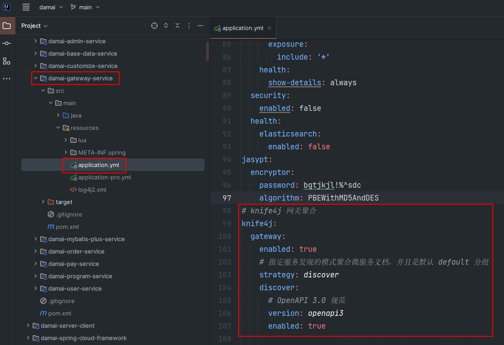
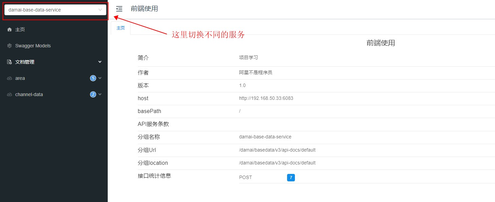
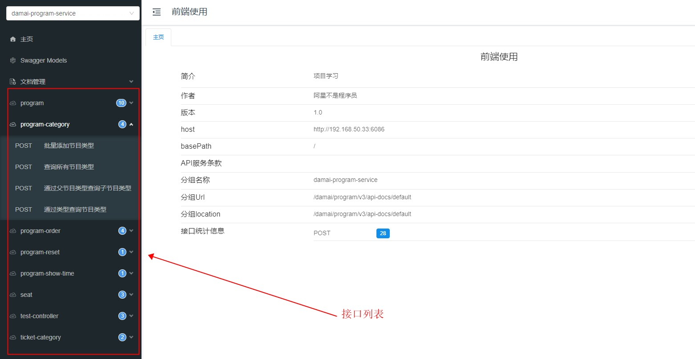

# 基础讲解-项目的接口文档

项目中集成了常用的接口文档工具 swagger，并且在此基础上还集成了对swagger的增强knife4j，使得ui界面看起来更加的美观

# 使用方法
1 先检查gateway服务中的配置文件中关于 knife4j的配置是否为true（默认为true）

2 然后将微服务依次启动起来，然后访问gateway服务的地址（[http://localhost:6085/doc.html](http://localhost:6085/doc.html)）即可

3 通过切换不同的服务，就可以查看不同服务下的接口介绍了

> 更新: 2024-10-08 17:14:21  
> 原文: <https://www.yuque.com/u22210564/ykdrdh/wotqggwgwy75qwfa>