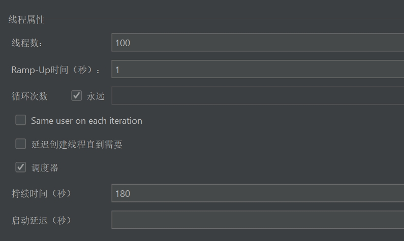
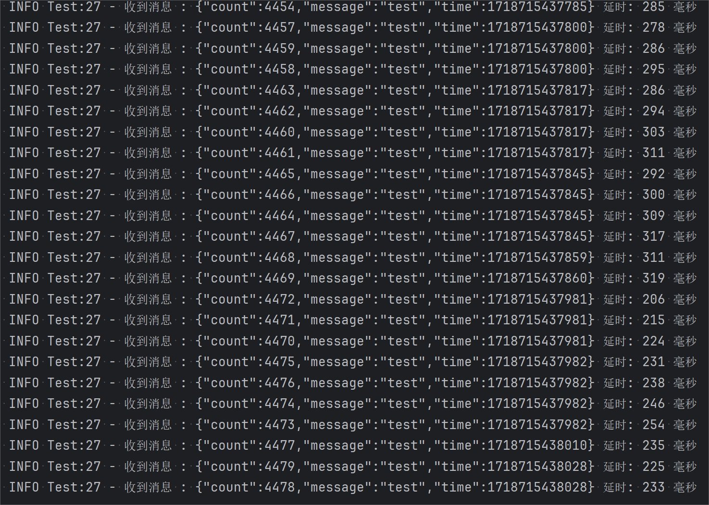
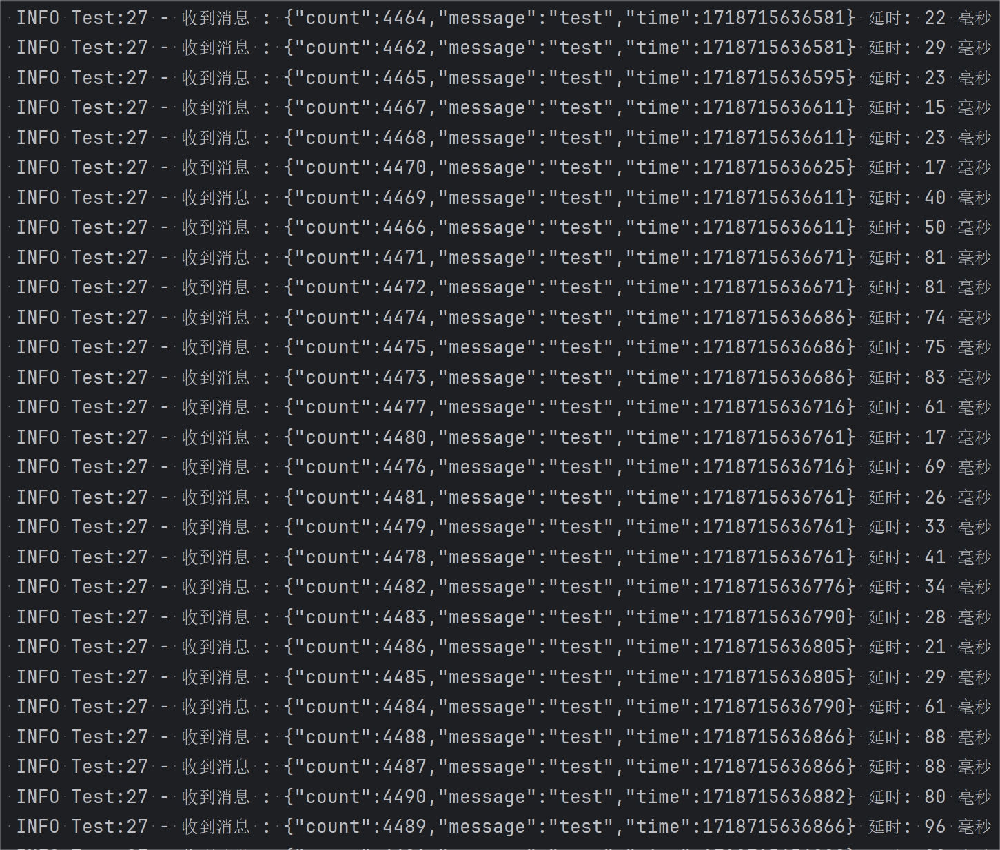

# 延迟队列优化压测结果

本章节是介绍对Redisson延迟队列优化的组件，关于此组件的详细介绍，可跳转以下章节来学习

[组件讲解-如何实现高性能延迟队列-发送消息](https://www.yuque.com/u22210564/ykdrdh/zhgo0z2smmvnz6ah)

[组件讲解-如何实现高性能延迟队列-消费消息](https://www.yuque.com/u22210564/ykdrdh/acr9dg80m26zq9hq)

# 压测参数


Jemter每秒创建100个线程进行发送消息，持续180s

# 压测配置
+ 压测的消息发送者是在节目服务中，消息发送者是在订单服务中
+ 两个服务都是在本地电脑启动，tomcat的参数采用默认
+ 节目服务的redis线程数量调整为300，因为要尽可能快速放入redis中
+ 订单服务的redis线程数量为默认，也就是8
+ Jmeter也是在本地电脑启动，发出压测请求
+ 本地电脑配置为 内存：32G、处理器：13900HX(24核心，32线程) 
+ redis部署在云服务器中，为单机部署，云服务器也有其他中间件在运行，带宽为：12Mbps  
+ 本地电脑的两个服务连接云服务器的redis，走的公网请求，网络环境一般
+ redis为单机部署

# 代码
### 节目服务-发送者
```java
@Slf4j
@Service
public class TestService {
    
    @Autowired
    private DelayQueueContext delayQueueContext;
    
    AtomicLong count = new PaddedAtomicLong(0);
    
    public boolean testSend(TestSendDto testSendDto) {
        try {
            testSendDto.setTime(System.currentTimeMillis());
            testSendDto.setCount(count.incrementAndGet());
            String message = JSON.toJSONString(testSendDto);
            delayQueueContext.sendMessage("test-topic",
                    message, 5000, TimeUnit.MILLISECONDS);
            log.info("发送消息 : {}",message);
        }catch (Exception e) {
            log.error("test send message error message : {}",JSON.toJSONString(testSendDto),e);
            return false;
        }
        return true;
    }
    
    public Boolean reset(final TestSendDto testSendDto) {
        count.set(0);
        return true;
    }
}
```

### 订单服务-消费者
```java
@Slf4j
@Service
public class Test implements ConsumerTask {
    
    @Autowired
    private DelayQueueContext delayQueueContext;
    
    
    @Override
    public void execute(String content) {
        TestSendDto testSendDto = JSON.parseObject(content, TestSendDto.class);
        log.info("收到消息 : {} 延时: {} 毫秒" ,content,System.currentTimeMillis() - testSendDto.getTime() - 5000);
    }
    
    @Override
    public String topic() {
        return "test-topic";
    }
}
```


节目服务进行发送消息，消息的延迟消费时间为5s

订单服务进行消费消息，接收到消息后，直接打印日志，并打印出延时时间，**注意这里打印的延时时间已经把本身延迟的5s扣除掉了**，所以打印的就是单纯消费消息的推迟时间

# 情况1
##### 发送者 1个分区
##### 消费者 1个分区 1个线程
+ count为消费消息的数量，可以看到一直在累加
+ 在消费到4000多条消息的时候，消息的延迟时间都在200-300毫秒左右，其实压测过程一直测到消费了1万多，延时都是200-300毫秒左右

# 情况2
##### 发送者 2个分区
##### 消费者 2个分区 核心线程数4 最大线程数8
+ 这里我们调到了延迟队列消费端的参数，将分区设置成了2个，核心线程数增加到4个，最大线程数增加到8个
+ 调整参数后，发现消息的延迟消费时间从 **200-300 **毫秒左右 减少到了 **20-90** 毫秒左右，可能看到优化效果非常的明显，将近5倍的差距了
+ 而且这里的redis是用的单机部署，所以实际上**并没有利用到分区优化**，因为分区的原理其实是将主题topic进行拆分到不同的redis节点上，但可以看到仅仅是调整了消费消息的线程池参数优化就已经很明显了，如果是部署redis集群，订单服务部署多个节点，效果会更加的显著！


> 更新: 2024-06-19 10:30:22  
> 原文: <https://www.yuque.com/u22210564/ykdrdh/kt60g81eipsibr4x>