# 项目集成prometheus和grafana

在实际的生产环境中，肯定是要对项目进行监控的，包括项目中重要接口的调用频率、jvm相关信息等等。而对于此信息的监控prometheus可以采集项目中的相关指标，并通过grafana进行图形化显示


本文来介绍如何在项目中集成这两者

## 项目依赖
### 添加监控依赖
```xml
<dependency>
    <groupId>org.springframework.boot</groupId>
    <artifactId>spring-boot-starter-actuator</artifactId>
</dependency>
```

此依赖已经在项目中添加了，这里是为了说明依赖的完整性

### 添加prometheus依赖
```xml
<dependency>
    <groupId>io.micrometer</groupId>
    <artifactId>micrometer-registry-prometheus</artifactId>
</dependency>
<!-- micrometer 核心包，按需引入，使用 Meter 注解或手动埋点时需要 -->
<dependency>
    <groupId>io.micrometer</groupId>
    <artifactId>micrometer-core</artifactId>
</dependency>
<!-- micrometer获取JVM相关信息，并展示在Grafana上 -->
<dependency>
    <groupId>io.github.mweirauch</groupId>
    <artifactId>micrometer-jvm-extras</artifactId>
    <version>0.2.2</version>
</dependency>
```

## 项目配置
要在项目的配置文件中添加如下配置：

```yaml
management:
  metrics:
    tags:
      application: ${spring.application.name}
  endpoints:
    #暴露所有端点信息
    enabled-by-default: true 
    web:
      exposure:
        include: '*'
    health:
      show-details: always
  security:
    enabled: false
  health:
    elasticsearch:
      enabled: false
  prometheus:
    metrics:
      export:
        enabled: true
```


### 以上的依赖和配置已在base-data服务中配置完毕，可作为参考


## 安装prometheus
### 下载
地址：<font style="color:rgb(77, 77, 77);">https://prometheus.io/download</font>

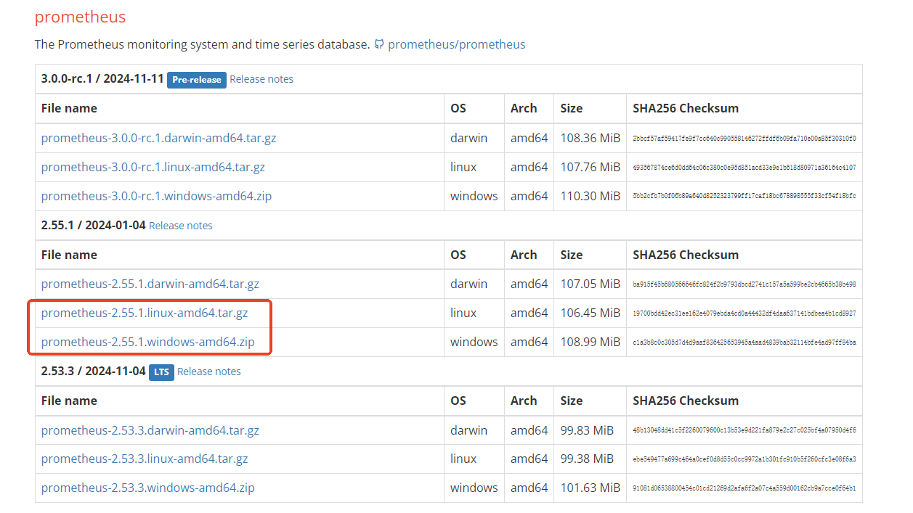

选择window或者linux

### 安装
```latex
# 解压缩安装
tar zvxf prometheus-2.55.1.linux-amd64.tar.gz
# 重命名
mv prometheus-2.55.1.linux-amd64 prometheus
# 进入目录
cd prometheus
# 修改配置
vim prometheus.yml
```

### 配置文件内容
```yaml
# my global config
global:
  scrape_interval: 15s # Set the scrape interval to every 15 seconds. Default is every 1 minute.
  evaluation_interval: 15s # Evaluate rules every 15 seconds. The default is every 1 minute.
  # scrape_timeout is set to the global default (10s).

# Alertmanager configuration
alerting:
  alertmanagers:
    - static_configs:
        - targets:
          # - alertmanager:9093

# Load rules once and periodically evaluate them according to the global 'evaluation_interval'.
rule_files:
  # - "first_rules.yml"
  # - "second_rules.yml"

# A scrape configuration containing exactly one endpoint to scrape:
# Here it's Prometheus itself.
scrape_configs:
  # The job name is added as a label `job=<job_name>` to any timeseries scraped from this config.
  - job_name: "prometheus"
    static_configs:
      - targets: ["localhost:8090"]
    # 要监控对应项目的服务名    
  - job_name: "online-base-data-service"
    metrics_path: '/actuator/prometheus'
    # 要监控对应项目的地址和端口号
    static_configs:
      - targets: ["localhost:6083"]
```

### 启动
```latex
# 读取指定yml配置启动,以8090端口后台启动
nohup ./prometheus --config.file=prometheus.yml --web.listen-address=:8090  > /prometheus.log 2>&1 &
```

### 访问
http://${ip}:8090

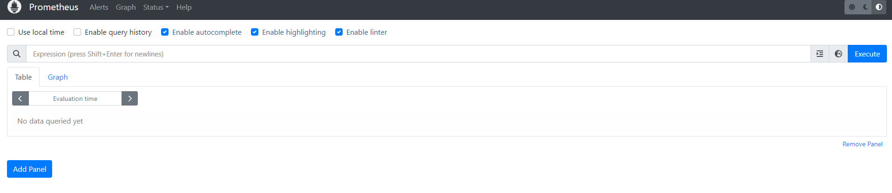

## 安装grafana
### 下载
地址：[https://grafana.com/grafana/download?pg=get&plcmt=selfmanaged-box1-cta1](https://grafana.com/grafana/download?pg=get&plcmt=selfmanaged-box1-cta1)


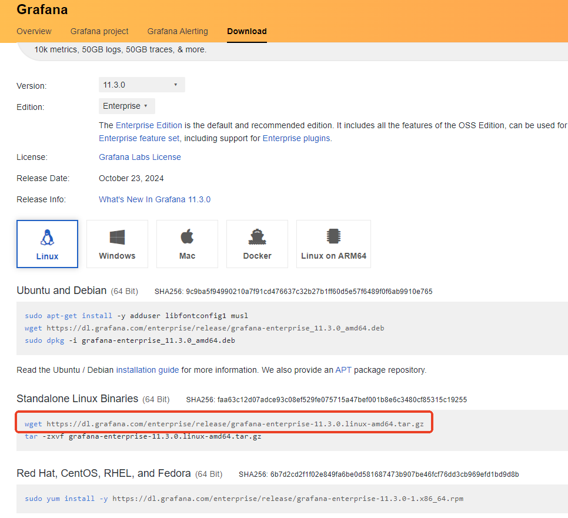

可以直接在linux上下载，我这里在本地电脑上下载的：[https://dl.grafana.com/enterprise/release/grafana-enterprise-11.3.0.linux-amd64.tar.gz](https://dl.grafana.com/enterprise/release/grafana-enterprise-11.3.0.linux-amd64.tar.gz)

### 安装
```latex
# 解压缩
tar -zxvf prometheus-2.55.1.linux-amd64.tar.gz
# 重命名
mv grafana-v11.3.0 grafana
# 进入目录
cd grafana/bin
# 后台启动
nohup ./grafana-server > /grafana.log 2>&1 &
```

### 访问
地址：http://${ip}:9000

账号和密码（默认）：admin/admin

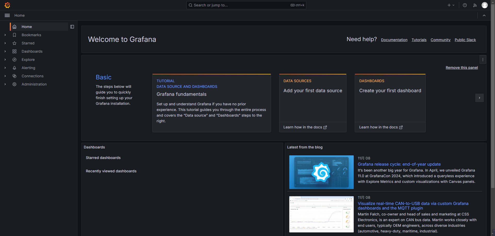


### 集成prometheus
#### 选择prometheus作为数据源
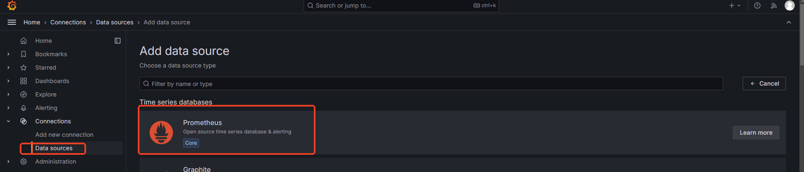

#### 配置prometheus的地址
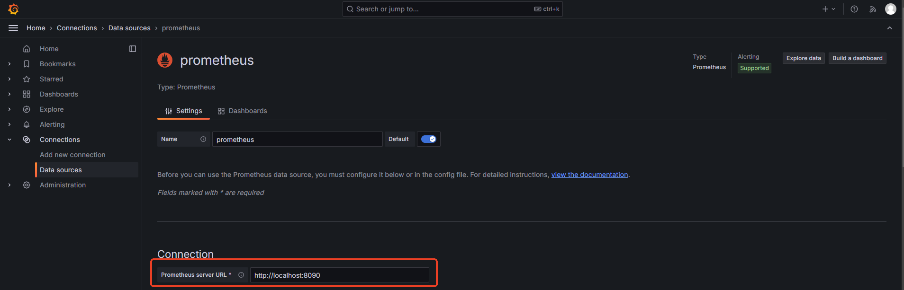

#### 往下拉到底，进行保存
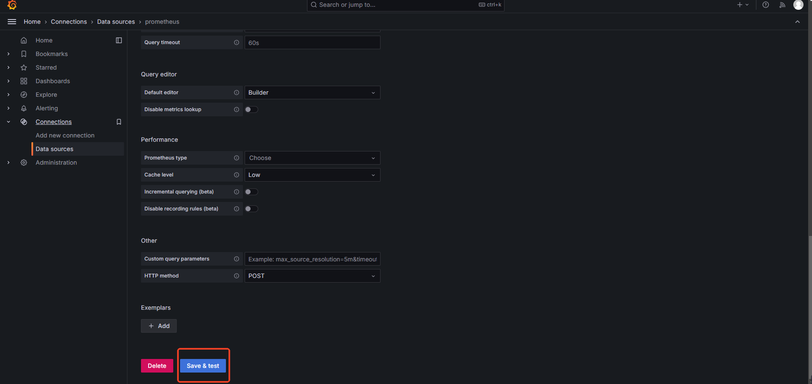

#### 点击保存后会接着让你构建仪表板配置
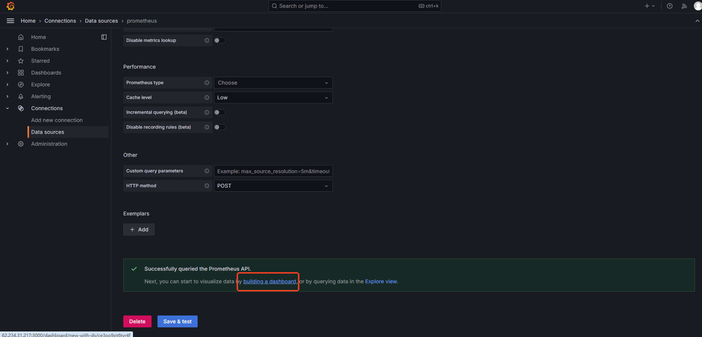

#### 导入仪表板配置
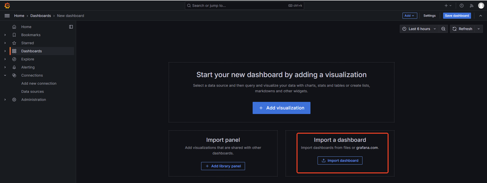

#### 把模板地址粘贴进去
我这里是用的监控jvm的模板，地址：

<font style="color:rgb(77, 77, 77);">https://grafana.com/grafana/dashboards/4701-jvm-micrometer/</font>

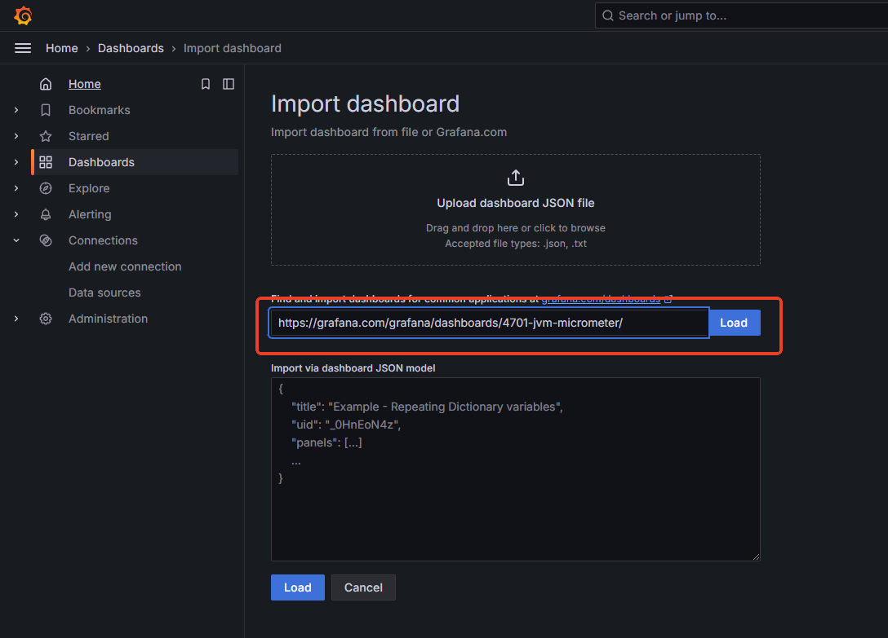

#### 继续选择Prometheus
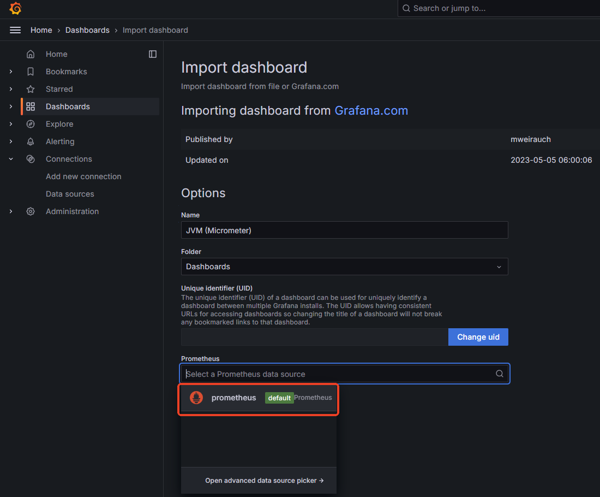

#### 选择Import导入
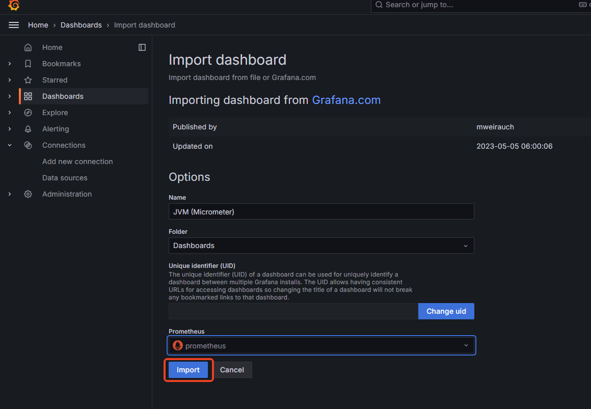

#### 能看到相关信息了
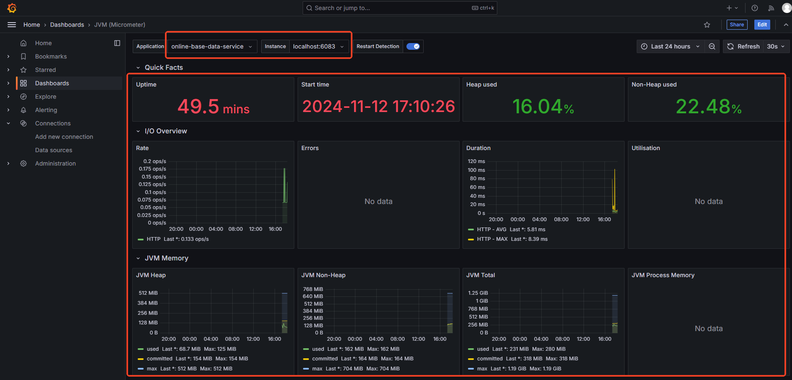


## 添加自定义指标
除了利用SpringBootActuator中提供的内置指标，我们还可以通过Micrometer添加自定义监控指标，以监控特定的业务逻辑或性能瓶颈。

```java
@RestController
public class CustomController {
private final Counter requestCounter;

public CustomController(MeterRegistry registry) {
    this.ordersCounter = Counter.builder("request_count")
                                .description("request count")
                                .register(registry);
}

@GetMapping("/order")
public String createOrder() {
    requestCounter.increment();
    return "success";
}

```

<font style="color:rgb(77, 77, 77);">这样在Grafana中，可以像Prometheus一样展示自定义指标。</font>


> 更新: 2024-11-12 18:35:10  
> 原文: <https://www.yuque.com/u22210564/ykdrdh/vkrnvf8ay33gzma5>