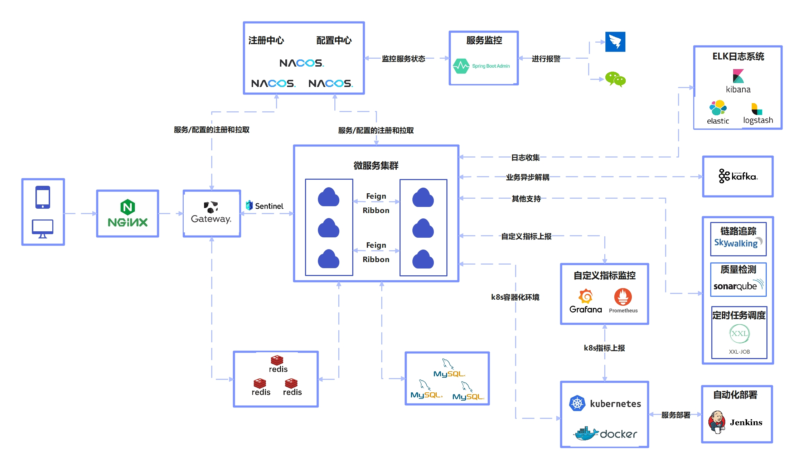

# 项目技术架构介绍

# 技术架构流程图

# 技术架构选型
| 技术 | 说明 | 官网 |
| --- | --- | --- |
| Spring-Boot | Web服务框架 | [https://spring.io/projects/spring-boot](https://spring.io/projects/spring-boot) |
| Spring-Cloud | 微服务框架 | [https://spring.io/projects/spring-cloud](https://spring.io/projects/spring-cloud) |
| Spring-Cloud-alibaba | alibaba微服务框架 | [https://github.com/alibaba/spring-cloud-alibaba](https://github.com/alibaba/spring-cloud-alibaba) |
| Spring-Cloud-Gateway | 微服务网关 | [https://spring.io/projects/spring-cloud-gateway](https://spring.io/projects/spring-cloud-gateway) |
| Nacos | 服务注册中心 | [https://nacos.io/zh-cn/index.html](https://nacos.io/zh-cn/index.html) |
| Sentinel | 服务熔断 | [https://sentinelguard.io/zh-cn/](https://sentinelguard.io/zh-cn/) |
| Log4j2 | 日志框架 | [https://github.com/apache/logging-log4j2](https://github.com/apache/logging-log4j2) |
| Mysql | 数据库 | [https://www.mysql.com/](https://www.mysql.com/) |
| MyBatis-Plus | ORM框架 | [https://baomidou.com](https://baomidou.com) |
| MyBatisGenerator | 数据层代码生成器 | [http://www.mybatis.org/generator/index.html](http://www.mybatis.org/generator/index.html) |
| AJ-Captcha | 图形验证码 | [https://gitee.com/anji-plus/captcha](https://gitee.com/anji-plus/captcha) |
| Kafka | 消息队列 | [https://github.com/apache/kafka/](https://github.com/apache/kafka/) |
| Redis | 分布式缓存 | [https://redis.io/](https://redis.io/) |
| Redisson | 分布式Redis工具 | [https://redisson.org](https://redisson.org) |
| Elasticsearch | 搜索引擎 | [https://github.com/elastic/elasticsearch](https://github.com/elastic/elasticsearch) |
| LogStash | 日志收集工具 | [https://github.com/elastic/logstash](https://github.com/elastic/logstash) |
| Kibana | 日志可视化查看工具 | [https://github.com/elastic/kibana](https://github.com/elastic/kibana) |
| Nginx | 静态资源服务器 | [https://www.nginx.com/](https://www.nginx.com/) |
| Docker | 应用容器引擎 | [https://www.docker.com](https://www.docker.com) |
| Jenkins | 自动化部署工具 | [https://github.com/jenkinsci/jenkins](https://github.com/jenkinsci/jenkins) |
| Hikari | 数据库连接池 | [https://github.com/brettwooldridge/HikariCP](https://github.com/brettwooldridge/HikariCP) |
| JWT | JWT登录支持 | [https://github.com/jwtk/jjwt](https://github.com/jwtk/jjwt) |
| Lombok | Java语言增强插件 | [https://github.com/rzwitserloot/lombok](https://github.com/rzwitserloot/lombok) |
| Hutool | Java工具类库 | [https://github.com/looly/hutool](https://github.com/looly/hutool) |
| Swagger-UI | API文档生成工具 | [https://github.com/swagger-api/swagger-ui](https://github.com/swagger-api/swagger-ui) |
| Knife4j | Swagger 增强框架 | [https://doc.xiaominfo.com](https://doc.xiaominfo.com) |
| Hibernator-Validator | 验证框架 | [http://hibernate.org/validator](http://hibernate.org/validator) |
| XXL-Job | 分布式定时任务框架 | [http://www.xuxueli.com/xxl-job](http://www.xuxueli.com/xxl-job) |
| ShardingSphere | 分库分表 | [https://shardingsphere.apache.org](https://shardingsphere.apache.org) |

> 更新: 2024-04-03 15:19:13  
> 原文: <https://www.yuque.com/u22210564/ykdrdh/fibck8zr2vfhvmvf>